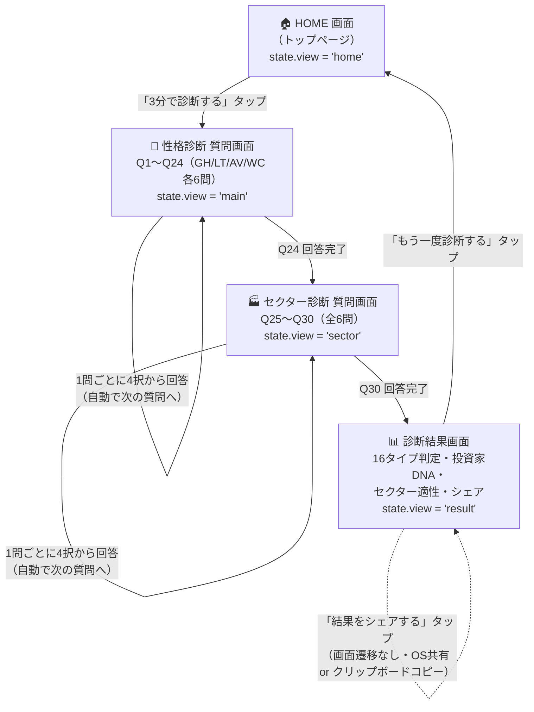

# ① 画面遷移図（J-KABU TYPE）

対象: `index.html` 1ページ内で `js/app.js` が `#app` の中身を差し替える SPA 構成（画面遷移＝状態(`state.view`)の切り替え）。

## 画面一覧と役割

| # | 画面名 | 実装上の状態 | 主な要素 | 次の遷移 |
|---|--------|--------------|----------|----------|
| 1 | HOME画面 | `view: "home"` | タイトル、コンセプト文、CTAボタン、16タイプ一覧プレビュー | 「3分で診断する」→ 性格診断 質問画面(Q1) |
| 2 | 性格診断 質問画面 | `view: "main"` | 進捗表示（質問 n/30）、A/B文言、4択回答ボタン | 回答タップで自動的に次の質問へ。Q24完了でセクター診断へ |
| 3 | セクター診断 質問画面 | `view: "sector"` | 進捗表示（質問 n/30）、質問文、4択回答ボタン | 回答タップで自動的に次の質問へ。Q30完了で結果画面へ |
| 4 | 診断結果画面 | `view: "result"` | 印影演出、16タイプ判定結果、投資家DNA（レーダーチャート＋12指標）、特徴、相性の良い投資スタイル、注意点、得意セクターTOP3、代表的投資家、シェア/リトライボタン | 「もう一度診断する」→ HOME画面に戻る（回答データは破棄） |

## 補足

- 全画面遷移はブラウザ内の状態変更のみで行われ、ページ遷移（URL変化）やサーバー通信は発生しない。
- 診断途中で回答を戻る（前の質問に戻る）導線は MVP では未実装。必要であれば `state.mainIndex` / `state.sectorIndex` を減算する「戻る」ボタンを性格診断・セクター診断画面に追加することで対応可能。
- 診断結果・回答内容はページを離れる（リロードする）と保持されない（DB・localStorage 等を使用しない方針のため）。
