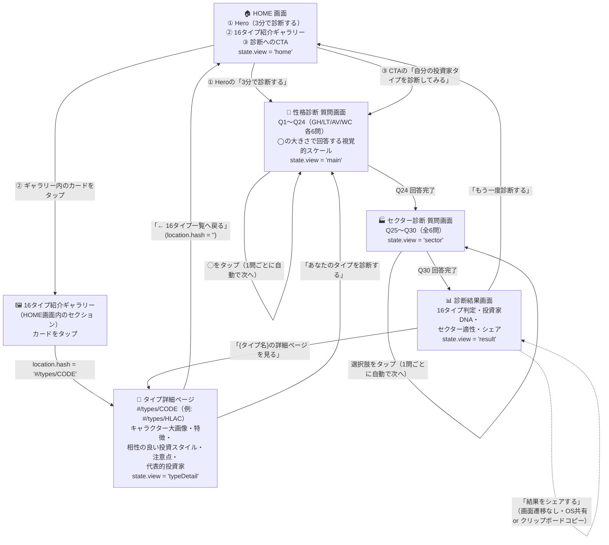

# ① 画面遷移図（J-KABU TYPE）

対象: `index.html` 1ページ内で `js/app.js` が `#app` の中身を差し替える SPA 構成。
「性格診断（診断開始→質問→結果）」の遷移は内部状態（`state.view`）の切り替えのみで行う一方、
**タイプ詳細ページはURLハッシュ（`#/types/CODE`）によるルーティング**を追加し、ブックマーク・共有・リロードに強い構成にしている（GitHub Pages上でもサーバー設定不要）。

## 画面一覧と役割

| # | 画面名 | 実装上の状態 / URL | 主な要素 | 次の遷移 |
|---|--------|------|----------|----------|
| 1 | HOME画面 | `view: "home"`（URL: ハッシュなし） | ①Hero（タイトル・CTA）／②16タイプ紹介ギャラリー（グリッド表示・カードクリックで詳細へ）／③診断へのCTA | 「3分で診断する」「自分の投資家タイプを診断してみる」→ 性格診断へ。ギャラリーのカードタップ → タイプ詳細ページへ |
| 2 | タイプ詳細ページ | `view: "typeDetail"`（URL: `#/types/{CODE}`） | 大きなキャラクター画像エリア、タイプ名・キャッチコピー、特徴、相性の良い投資スタイルTOP3、注意点、代表的投資家、「一覧へ戻る」「タイプを診断する」導線 | 「← 16タイプ一覧へ戻る」→ HOME画面。「あなたのタイプを診断する」→ 性格診断へ |
| 3 | 性格診断 質問画面 | `view: "main"` | 進捗表示（質問 n/30）、A/B文言、円の大きさで回答する視覚的7段階スケール | ◯タップで自動的に次の質問へ。Q24完了でセクター診断へ |
| 4 | セクター診断 質問画面 | `view: "sector"` | 進捗表示（質問 n/30）、質問文、4択回答ボタン | 回答タップで自動的に次の質問へ。Q30完了で結果画面へ |
| 5 | 診断結果画面 | `view: "result"` | 印影演出、16タイプ判定結果、投資家DNA（レーダーチャート＋12指標）、特徴、相性の良い投資スタイル、注意点、得意セクターTOP3、代表的投資家、「タイプの詳細ページを見る」「シェア」「もう一度診断する」 | 「もう一度診断する」→ HOME画面（回答データは破棄）。「{タイプ名}の詳細ページを見る」→ 該当タイプの詳細ページへ |

## タイプ詳細ページのルーティングについて

- URLは `https://<公開先>/#/types/HLAC` のようなハッシュベースの形式になる。フロントエンドのみ・ビルド不要・GitHub Pages無料枠という前提のもと、サーバー側のリライト設定なしで「個別URLの共有」「ブラウザの戻る/進むボタン」「直接アクセス・リロード」がすべて問題なく動作する方式として採用した。
- 16タイプ分のURLは以下の通り：`#/types/GLAW` `#/types/GLAC` `#/types/GLVW` `#/types/GLVC` `#/types/GTAW` `#/types/GTAC` `#/types/GTVW` `#/types/GTVC` `#/types/HLAW` `#/types/HLAC` `#/types/HLVW` `#/types/HLVC` `#/types/HTAW` `#/types/HTAC` `#/types/HTVW` `#/types/HTVC`
- 存在しないコードがハッシュに指定された場合はHOME画面にリダイレクトする。

## 補足

- 全画面遷移はブラウザ内の状態変更のみで行われ、タイプ詳細ページ以外はサーバー通信を伴わない。
- 診断途中で回答を一つ前の質問に戻る導線は本バージョンでは未実装（`state.mainIndex` / `state.sectorIndex` を減算する「戻る」ボタンを追加すれば対応可能）。
- 診断結果・回答内容はページを離れる（リロードする）と保持されない（DB・localStorage等を使用しない方針のため）。タイプ詳細ページのみURLで状態を保持できる。
